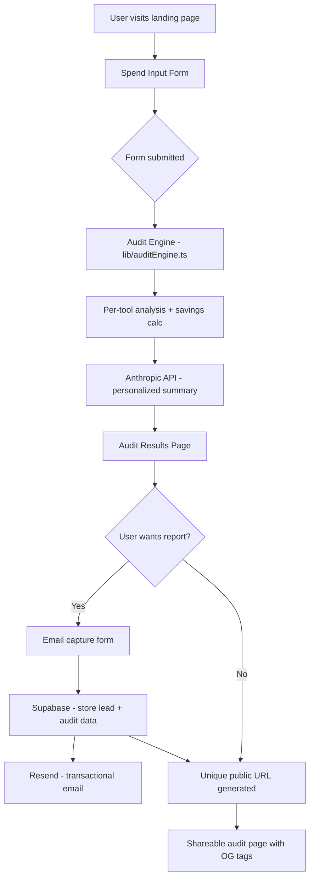

# Architecture

## System Diagram

---

## Data Flow

### How a user's input becomes an audit result

1. **Input** — User fills the spend form: tool name, plan, monthly 
spend, number of seats, team size, primary use case. Form state is 
persisted to `localStorage` so reloads don't lose data.

2. **Audit Engine** — On submit, `lib/auditEngine.ts` runs pure 
deterministic rules against the input. No AI here — the logic is 
hardcoded and testable. For each tool it checks:
   - Is the user on the right plan for their seat count?
   - Is there a cheaper plan from the same vendor that fits?
   - Is there a cheaper alternative tool for their use case?
   - Are they paying retail vs what credits could offer?

3. **Savings Calculation** — Engine outputs per-tool recommendations 
with monthly and annual savings numbers. All figures trace back to 
`PRICING_DATA.md`.

4. **AI Summary** — Audit result is passed to the Anthropic Claude API 
to generate a ~100 word personalized paragraph. If the API call fails, 
a templated fallback summary is shown. The user never sees an error.

5. **Results Page** — Rendered server-side in Next.js. Shows per-tool 
breakdown, total savings hero, and Credex CTA if savings > $500/mo.

6. **Lead Capture** — User optionally enters email + company + role. 
Stored in Supabase with the full audit snapshot. Resend fires a 
transactional confirmation email.

7. **Shareable URL** — Each audit gets a UUID-based public URL 
(`/audit/[id]`). PII (email, company name) is stripped. Tools and 
savings numbers are shown. Open Graph tags are set server-side for 
clean link previews on Twitter/X and Slack.

---

## Why This Stack

| Choice | Reason |
|--------|--------|
| **Next.js 14 App Router** | SSR needed for dynamic OG tags per audit URL. API routes handle Anthropic + Supabase calls server-side, keeping secrets out of the browser. |
| **TypeScript** | Audit engine has complex nested logic. Types catch mistakes at compile time, not at runtime in a reviewer's browser. |
| **Tailwind + shadcn/ui** | Ships zero unused CSS. Radix primitives give accessibility for free — required Lighthouse ≥ 90. |
| **Supabase** | Free tier handles our scale. Row Level Security makes it easy to strip PII from public audit URLs. No infra to manage in a 7-day build. |
| **Resend** | Simplest transactional email API. Free tier is 3,000 emails/month. One SDK call, no SMTP config. |
| **Vercel** | Zero-config Next.js deploy. Edge network handles OG image rendering fast. Free tier sufficient. |

---

## What I'd Change at 10,000 Audits/Day

1. **Queue the AI summary** — At scale, synchronous Anthropic API calls 
would bottleneck the results page. Move to a background job queue 
(Inngest or BullMQ) and show the summary after a 2–3 second async load.

2. **Edge caching for audit results** — Public shareable audit pages are 
read-heavy. Cache them at the CDN edge with a long TTL since audit data 
never changes after creation.

3. **Rate limiting at the edge** — Move from app-level rate limiting to 
Vercel Edge Middleware to block abuse before it hits the server.

4. **Separate read/write DB** — Supabase read replicas for the public 
audit pages, primary for lead writes. Prevents audit reads from 
competing with form submissions.

5. **Pricing data pipeline** — Manual `PRICING_DATA.md` doesn't scale. 
Build a scheduled scraper (GitHub Actions cron) that checks vendor 
pricing pages weekly and flags diffs for human review.