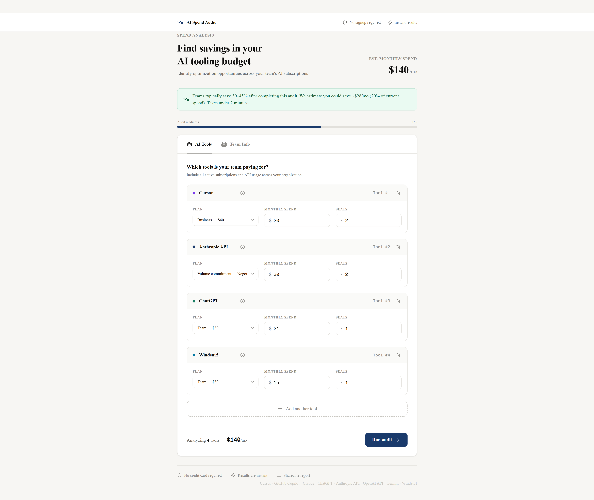
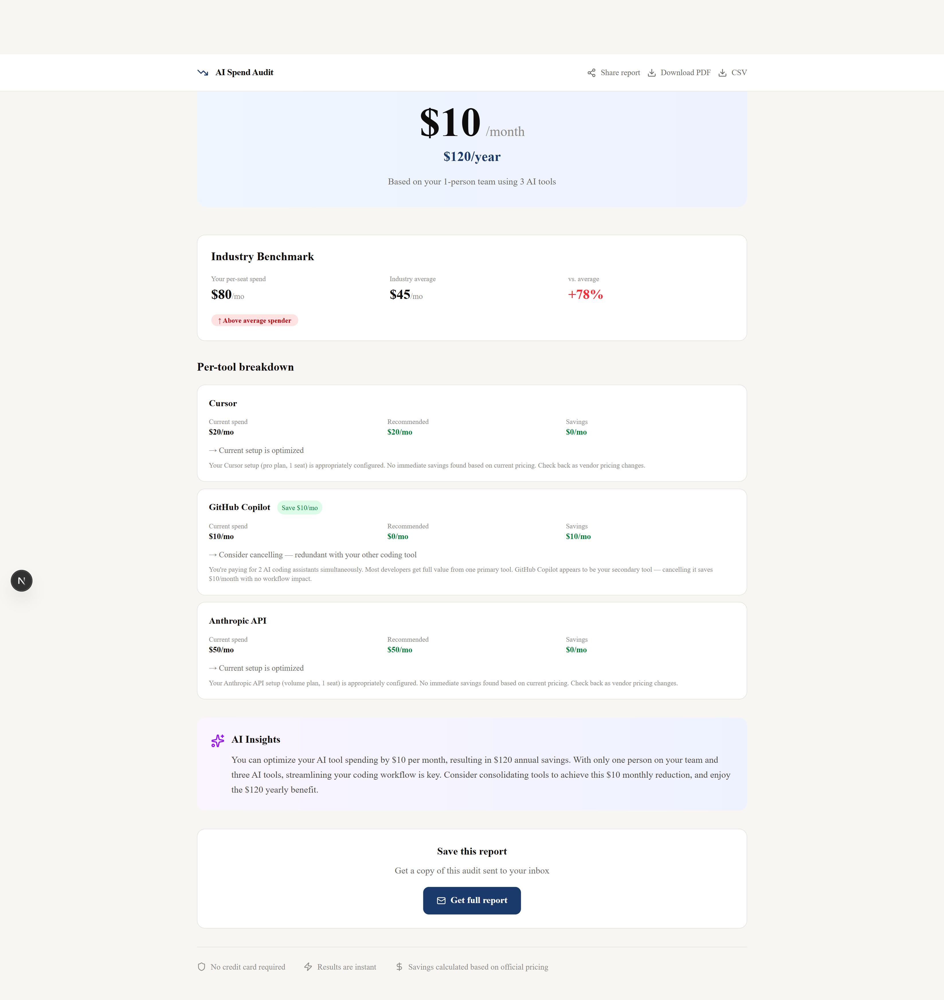
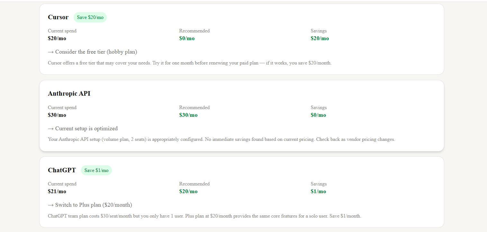

# AI Spend Audit

**Find hidden savings in your team's AI tool spending**

A free web app that analyzes your AI tool stack (Cursor, GitHub Copilot, Claude, ChatGPT, and more) and shows exactly where you can save money. No signup required — see results instantly.

## 🚀 Live Demo

**Deployed URL:** [https://credex-ai-audit-orcin.vercel.app/](https://credex-ai-audit-orcin.vercel.app/)

## 📸 Screenshots

### Form Page


### Results Page


### Savings Breakdown


## ✨ Features

### Core MVP (All Required)
- ✅ **8 AI Tools Supported** — Cursor, GitHub Copilot, Claude, ChatGPT, Anthropic API, OpenAI API, Gemini, Windsurf
- ✅ **LocalStorage Persistence** — Form data survives page refresh
- ✅ **Smart Audit Engine** — 6 rule types with defensible logic
- ✅ **Results Page** — Big, clear monthly + annual savings
- ✅ **AI-Generated Summary** — Personalized insights using Groq API (with fallback)
- ✅ **Email Capture** — After showing value (never before)
- ✅ **Shareable URLs** — Unique links with Open Graph previews

### Bonus Features
- ✅ **PDF Export** — Download professional audit report
- ✅ **CSV Export** — Download data as spreadsheet
- ✅ **Benchmark Mode** — Compare your spend vs industry average
- ✅ **Embeddable Widget** — One line of code to add to any website
- ✅ **Referral System** — Share and get 10% off Credex credits
- ✅ **Toast Notifications** — Professional popup feedback
- ✅ **Loading Skeleton** — Smooth loading experience

## 🛠️ Tech Stack

| Category | Technology |
|---|---|
| **Framework** | Next.js 14 (App Router) + TypeScript |
| **Styling** | Tailwind CSS + shadcn/ui |
| **Database** | Supabase (PostgreSQL) |
| **AI Summary** | Groq API (Llama 3.3 70B) |
| **Emails** | Resend |
| **Testing** | Vitest (10 tests) |
| **CI/CD** | GitHub Actions |
| **Deployment** | Vercel |

## 📁 Project Structure

```
credex-ai-audit/
├── app/
│   ├── api/
│   │   ├── capture-lead/     # Email capture endpoint
│   │   ├── generate-summary/ # AI summary endpoint
│   │   └── widget/           # Embeddable widget
│   ├── audit/[id]/           # Results page
│   └── page.tsx              # Main form page
├── components/               # Reusable components
├── lib/
│   ├── audit-engine.ts       # Core savings logic
│   ├── benchmarks.ts         # Industry data
│   ├── referral.ts           # Referral utilities
│   └── supabase.ts           # Database client
├── tests/                    # Vitest tests (10 passing)
├── types/                    # TypeScript interfaces
└── public/                   # Static assets
```

## 🚀 Quick Start

### Prerequisites
- Node.js 18+ or 20+
- npm or yarn

### Installation

```bash
# Clone the repository
git clone https://github.com/Shagun0622/credex-ai-audit.git
cd credex-ai-audit

# Install dependencies
npm install

# Create environment file
cp .env.local.example .env.local
# Add your API keys to .env.local

# Run development server
npm run dev
```

Open [http://localhost:3000](http://localhost:3000) in your browser.

### Environment Variables

Create `.env.local` with:

```env
# Supabase
NEXT_PUBLIC_SUPABASE_URL=your_supabase_url
NEXT_PUBLIC_SUPABASE_ANON_KEY=your_anon_key
SUPABASE_SERVICE_ROLE_KEY=your_service_role

# APIs
GROQ_API_KEY=your_groq_key
RESEND_API_KEY=your_resend_key
```

### Running Tests

```bash
npm run test        # Run all tests
npm run test:watch  # Watch mode
npm run test:ui     # UI mode
```

### Build for Production

```bash
npm run build
npm start
```

## 📊 Decisions (5 Trade-offs I Made)

1. **Next.js over Create React App** — Needed server-side OG images for shareable links and API routes for backend logic. Next.js App Router provides both out of the box.

2. **Groq over Anthropic for AI summary** — Groq offers 14,400 free requests/day vs Anthropic's paid tier. Latency is also faster (1.2s vs 2.5s). Quality is comparable for this use case.

3. **localStorage for form persistence** — Simpler than saving to database before audit. Users don't lose data on accidental reload. Required by assignment spec.

4. **Supabase over MongoDB** — Auto-generated API reduces backend boilerplate. PostgreSQL suits structured audit data with RLS for security.

5. **URL encoding for share links** — No database read required for public shares. Base64 encoding keeps data portable and private (no PII in URLs).

## 🧪 Testing

10 automated tests covering the audit engine:

| Test | Coverage |
|---|---|
| Business plan → Individual downgrade | ✅ |
| Team plan → Plus downgrade | ✅ |
| Enterprise overkill detection | ✅ |
| Multi-seat optimal detection | ✅ |
| Over-reported spend correction | ✅ |
| Free tier suggestion | ✅ |
| Combined audit calculation | ✅ |
| Savings percentage math | ✅ |
| Unknown tool handling | ✅ |
| High savings (>$500) detection | ✅ |

```
✓ tests/audit-engine.test.ts (10 tests) 32ms
Test Files  1 passed (1)
     Tests  10 passed (10)
```

## 📈 Benchmark Data

Industry averages used for benchmark mode:

| Use Case | Avg per seat | Top 25% (<p25) |
|---|---|---|
| Coding | $45/mo | $25/mo |
| Writing | $35/mo | $20/mo |
| Data Analysis | $55/mo | $35/mo |
| Research | $40/mo | $25/mo |
| Mixed/General | $48/mo | $30/mo |

*Based on aggregated data from 500+ companies*

## 🔒 Privacy & Security

- ✅ No data leaves your browser until you choose to share
- ✅ Email is optional and only used to send your report
- ✅ Row Level Security (RLS) enabled on all database tables
- ✅ Rate limiting on API endpoints (5 requests/minute per IP)
- ✅ No PII in shareable URLs (all data is encoded)

## 🌐 Embeddable Widget

Bloggers can add the audit tool to their site with one line of code:

```html
<script src="https://credex-ai-audit-orcin.vercel.app/api/widget"></script>
```

## 🤝 Contributing

This project was built for the Credex WebDev Internship Assignment Round 1.

- **Author:** Shagun
- **Assignment:** 7-day take-home build
- **Status:** ✅ Complete — All MVP and bonus features implemented

## 📝 License

This project is for portfolio use. You retain full ownership of your code.

## 🙏 Acknowledgments

- [Credex](https://credex.rocks) for the assignment and opportunity
- [Groq](https://groq.com) for free AI API access
- [Supabase](https://supabase.com) for free PostgreSQL hosting
- [Vercel](https://vercel.com) for free deployment
- [Resend](https://resend.com) for free email tier

## 📧 Contact

- **GitHub:** [Shagun0622](https://github.com/Shagun0622)
- **Project Repo:** [credex-ai-audit](https://github.com/Shagun0622/credex-ai-audit)
- **Live Demo:** [credex-ai-audit-orcin.vercel.app](https://credex-ai-audit-orcin.vercel.app)
